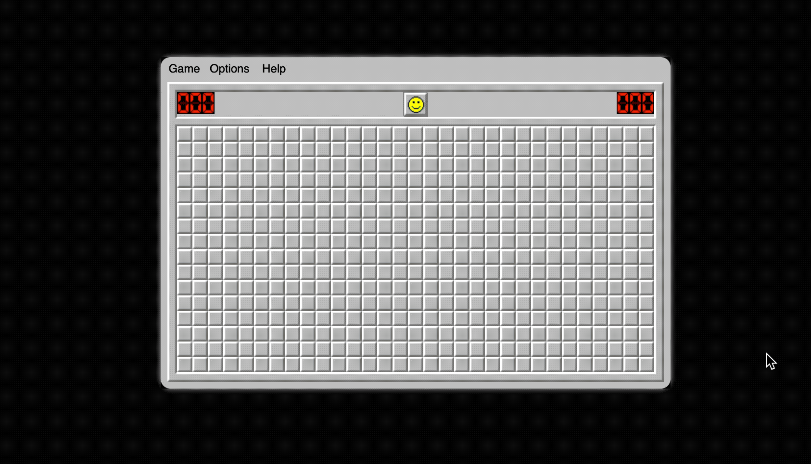

# SAT-based Classic MineSweeper Solver




## Introduction

This is a SAT-based MineSweeper solver.
It interactively plays online MineSweeper game provided by [freeminesweeper.org](https://freeminesweeper.org) through usual human-computer interface.
It detects the board by sliding window template matching and uncover the mines by simulating left/right mouse clicks.
It can play on all configuration of boards (height, width, number of mines).
It logs all events needed to reproduce the process.
It detects whether it loses or wins.
Due to the new interface of freeminesweeper.org, it cannot begin a new round automatically now.

## How to use

### Online game

Open [freeminesweeper.org](https://freeminesweeper.org)'s minesweeper board page.
Be sure to expose the entire board on screen.
Now run command

```bash
# don't need to run this everytime
#python3 -m virtualenv rt

. rt/bin/activate

# don't need to run this everytime
#pip install -r requirements.txt

# run this to play without considering mines remaining
python -m mwagent

# run this to play taking into account mines remaining,
# where `-m99' below indicates that there are 99 mines
# in total, as in Expert level. you need to change
# this number according to the actual mines number
#python -m mwagent -m99

# run this to use a different solver than the default
# one. a list of solvers can be found by
# `python -m mwagent --help`
#python -m mwagent -Smcdfssolver
```

Again, be sure not to overlap the Terminal window with the board.
Wait 10 seconds the computer will play on its own.

Enjoy watching it playing!

### One-step solution

Perform a one-step solution given a board.
Find example boards in [example\_boards](example_boards).

```bash
python -m fullsatsolver example_boards/2.csv
#python -m mcdfssolver example_boards/2.csv
```

### Virtual game

Given a board with all cells uncovered and the first-step solution, you may watch the program playing virtual Minesweeper game without opening the browser.
Find example boards in [example\_boards/key](example_boards/key).

```bash
python -m virtual.mwagent example_boards/key/1.csv
```

You may also switch different solver using `-S` option.
See more help by `python -m virtual.mwagent --help`.

The virtual games can be used to compare which solver is faster on which type of board.

## Mechanism

### `fullsatsolver`

The core mechanism is to convert current MineSweeper board into a CNF, and resort to [MiniSAT](http://minisat.se/), a fast SAT solver, to get the solution.
Due to lack of assumptions (e.g. certain key cells haven't been uncovered yet), it often occurs that a number of possible solutions are returned (up to 3000).
To disambiguate, I find the symbol that maintain its set/clear state the most throughout all solutions.
If that symbol is always set or always cleared, a.k.a. having mine underneath or otherwise, then it's definitely that state.
If that symbol is mostly one state but sometimes the other, then the former state is a better guess.
Although it's the best guess one can make, still it sometimes loses.
I take into account the number of mines remaining as soon as it's no longer intractable, giving higher accuracy.

### `mcdfssolver`

The core mechanism is to convert current MineSweeper board into a set of problems.
For example: c\_i1, c\_i2, ... c\_im have in total k mines.
Then I brute-force search all possible solutions in the set of problems.
However, when there are many problems, it becomes intractable to search all possibilities.
Therefore, I recursively bipartition the set of problems into smaller sets until the result set becomes tractable.
I bipartition using [global Min-cut algorithm](https://stanford.edu/~rezab/classes/cme305/W14/Notes/4.pdf), using problems as nodes and Jaccard similarity between problems as edge capacity.
In practice (I tried up to `40x80` board), `mcdfssolver` is 2x to 8x faster than `fullsatsolver`, and I haven't found any inconsistency between their results.

<!-- TODO introducing other solvers -->

## Future works

- Other solvers: e.g. I'm thinking about using KL-bisection and DFS algorithm together with SAT to solve board.
  I may remove this entry in the future if the idea is found not possible or intractable for me.

## More about Minesweeper

- [MinesweeperWiki](https://minesweepergame.com/website/authoritative-minesweeper/wiki/Main_Page)
- [Minesweeper Game World Ranking](http://www.minesweeper.info/worldranking.php?ranking=1&utm_source=wechat_session&utm_medium=social&utm_oi=971045615085588480)
